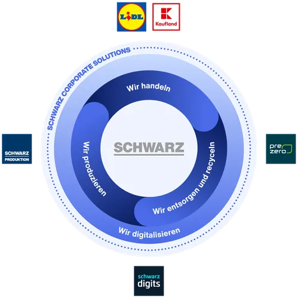

# Willkommen bei 101 STACKIT

Eine Einführung in STACKIT

  
    Drücken Sie die Leertaste für die nächste Folie <carbon:arrow-right class="inline"/>
  

---

# Was ist STACKIT?

STACKIT ist das digitale Rückgrat für Cloud-Lösungen und IT-Dienste innerhalb der Schwarz Gruppe.

  <strong>- Digitaler Lösungsanbieter: </strong> Unterstützung von Unternehmen mit Cloud- und digitalen Lösungen.

   <strong>- Partner der Schwarz Gruppe: </strong> Fokus auf die Bedürfnisse der Handelsbranche.

 <strong> - Innovationsfokus:</strong> Gewährleistung von Skalierbarkeit, Sicherheit und Flexibilität.

---

# Wo kommen wir her?

  STACKIT ist das digitale Rückgrat für Cloud-Lösungen und IT-Dienste innerhalb der Schwarz Gruppe.

---

## Schwarz Gruppe auf einen Blick

  

    <strong>33 Länder</strong>  
    Präsenz in über 33 Ländern weltweit.
  

  

    <strong>458.000 Mitarbeiter</strong>  
    Eine der größten Arbeitsgebergruppen.
  

  

    <strong>113,3 Mrd. € Umsatz</strong>  
    Marktführer im Handel.
  

---

## Bedeutung der Cloud für die Zukunft

  

    

      - Nutzung externer Anbieter führt zu Abhängigkeit und hohen Kosten.
    

    

      - Ziel: 70 % des gesamten Workflows auf STACKIT migrieren.
    

    

      - STACKIT wird nicht nur für interne Prozesse genutzt, sondern auch als Public-Cloud-Angebot für externe Kunden.
    

  

---

## Was bieten wir an?

  

    <strong>Cloud-Lösungen</strong>  
    Bauen eine Cloud als deutscher/ europäischer Anbieter.
  

  

    <strong>Europäische Standards</strong>  
    Cloud nach den höchsten europäischen Standards.
  

  

    <strong>Datenschutz & Sicherheit</strong>  
    Höchste Datenschutz- und Sicherheitsstandards gemäß EU-Vorgaben.
  

 
---

# Unser Angebot

STACKIT stellt eine Vielzahl von Cloud-Services zur Verfügung:

  
- <strong>Compute- und Storage-Services</strong>: Virtuelle Maschinen, Objektspeicherung und Kubernetes-Dienste.

  
- <strong>Datenmanagement und Sicherheit</strong>: Tools für Datenschutz, Compliance und Backup.

  
- <strong>Entwicklertools</strong>: CI/CD-Pipelines und Testlösungen.

  
- <strong>Skalierbare Infrastruktur</strong>: Lösungen, die mit dem Geschäftsbedarf wachsen.

---

# Unsere Rechenzentren

STACKIT betreibt strategisch platzierte Rechenzentren in Europa:

  
- <strong>Primärstandorte</strong>: Rechenzentren in Deutschland und anderen Teilen Europas.

  
- <strong>Sicherheitsstandards</strong>: Strenge Richtlinien für Datensicherheit.

  
- <strong>Grüne Infrastruktur</strong>: Energieeffiziente Geräte und nachhaltige Praktiken.

 

---

# Unser Weg in die Zukunft

STACKIT plant die Erweiterung seiner Dienstleistungen:

  
- <strong>Mehr Automatisierung</strong>: Verbesserte Tools für schnellere Bereitstellung.

  
- <strong>KI- und Machine-Learning-Services</strong>: KI-getriebene Anwendungen.

  
- <strong>Erweiterte Sicherheitsfunktionen</strong>: Neue Features für Datenschutz.

---

# Warum STACKIT wählen?

STACKIT überzeugt durch ein sicheres, skalierbares und kundenorientiertes Cloud-Erlebnis:

  
- <strong>Kundenfokus</strong>: Priorisierung branchenspezifischer Anforderungen.

  
- <strong>Zuverlässigkeit</strong>: Erfolgreicher Einsatz in Handelsumgebungen.

  
- <strong>Innovation und Anpassungsfähigkeit</strong>: Zukunftsorientierte Lösungen.

---

# Vielen Dank für Ihr Interesse an STACKIT!

Erkunden Sie unsere Services und entdecken Sie, wie STACKIT Ihr Unternehmen unterstützen kann.

  [Mehr erfahren auf stackit.cloud](https://stackit.cloud) · [GitHub](https://github.com/stackit) · [Dokumentation](https://docs.stackit.cloud)

